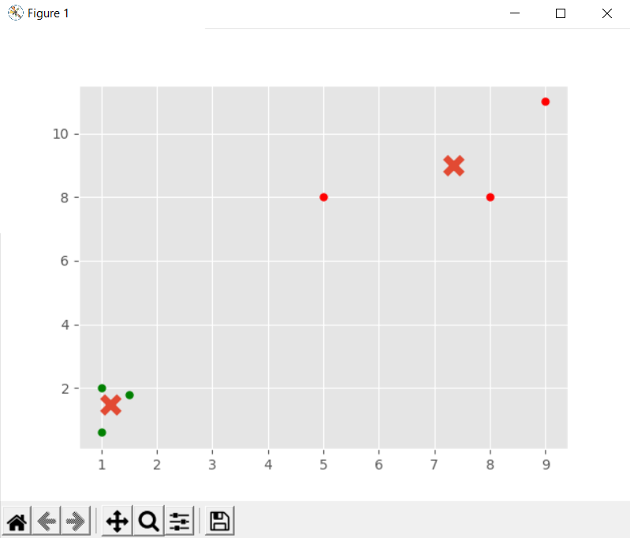

# Unsupervised-Machine-Learning Flat Clustering
K-Means clusternig example with Python and Scikit-learn 
# Flat clustering
Clustering algorithms group a set of documents into subsets or clusters . The algorithms' goal is to create clusters that are coherent internally, but clearly different from each other. In other words, documents within a cluster should be as similar as possible; and documents in one cluster should be as dissimilar as possible from documents in other clusters.
# Hierarchical 
Hierarchical clustering is where the machine is allowed to decide how many clusters to create based on its own algorithms.
# İmages

# Setup
After downloading the required modules, run the file. You can play on it as much as you want.
# Resources
https://pythonprogramming.net/flat-clustering-machine-learning-python-scikit-learn/  
https://nlp.stanford.edu/IR-book/html/htmledition/flat-clustering-1.html  
https://www.youtube.com/watch?v=ijUMKMC4f9I  
https://nlp.stanford.edu/IR-book/pdf/16flat.pdf  
https://docs.scipy.org/doc/scipy/reference/generated/scipy.cluster.hierarchy.fcluster.html  
https://scikit-learn.org/stable/modules/clustering.html  
# Who Do These Codes Belong To?
All of these Codes belong to Sentdex. Thanks Senddex.

